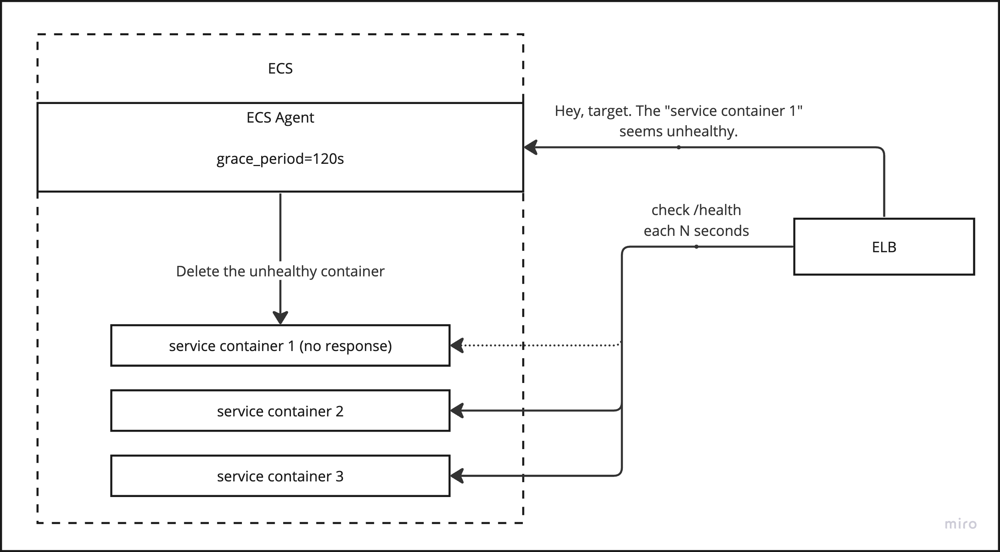
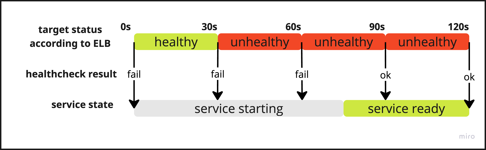
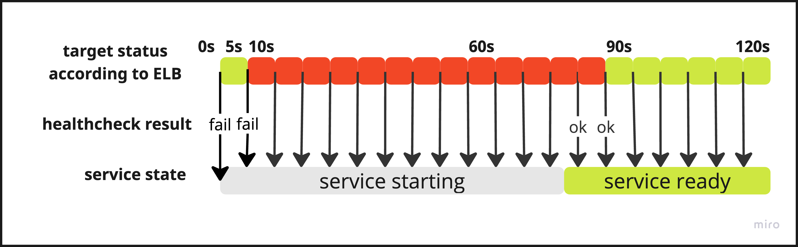

+++
title = 'AWS Grace Period Caveat'
date = 2023-09-18T18:29:19+03:00
draft = false
+++

Недавно понадобилось добавить наполнение кеша на старте сервиса.  
Задача понятная, на старте грузим данные в кеш, потом периодически его обновляем. Все было хорошо пока не настало время деплоя сервиса.

## Что пошло не так?

Код слит, CI работает, а сервис поднимается и сразу же оказывается отключен ECS по результатам health check. В логах все хорошо, видно как сервис стартует без ошибок.

Что же делать? Естественно, при проблемах с health check я полез смотреть настройки [ELB](https://docs.aws.amazon.com/elasticloadbalancing/index.html) health check для соответствующей [target group](https://docs.aws.amazon.com/AmazonECS/latest/userguide/create-network-load-balancer.html).  
Там были такие настройки:

|                     |                                     |
| ------------------- | ----------------------------------- |
| Healthy threshold   | 5 consecutive health check passed   |
| Unhealthy threshold | 2 consecutive health check failures |
| Timeout             | 5 seconds                           |
| Interval            | 30 seconds                          |

Из этих настроек получается, что после старта сервиса каждые 30 секунд балансировщик будет посылать запросы на указанный health check URL. Через 2 запроса (60 сек) сервис считается нерабочим и будет удален.

Все эти данные навели на мысль, что надо бы измерить время запуска сервиса. Добавил логи на старте сервиса и запустил его еще раз чтобы собрать данные. Сервис стартовал где-то за 80 ± 5 секунд. Стало понятно куда копать.

## Пробуем решить проблему

Первым делом выйдем в интернет за готовым решением проблемы. Вот самое информативное, что удалось найти по проблеме:

- [https://repost.aws/knowledge-center/elb-ecs-tasks-improperly-replaced](https://repost.aws/knowledge-center/elb-ecs-tasks-improperly-replaced)
- [https://repost.aws/knowledge-center/ecs-fargate-health-check-failures](https://repost.aws/knowledge-center/ecs-fargate-health-check-failures)
- [https://docs.aws.amazon.com/autoscaling/ec2/userguide/health-check-grace-period.html](https://docs.aws.amazon.com/autoscaling/ec2/userguide/health-check-grace-period.html)

Готового решения не нашлось, но были интересные записи про health check grace period. Это время, в которое EСS игнорирует "unhealthy" статус сервиса. Кажется, то, что нужно.

### Какие варианты решения можно придумать после исследования проблемы?

1. Поставить health check grace period в настройках сервиса в ECS равным 120 секундам
2. Повысить Unhealthy threshold до 5 consecutive health check failures
3. Увеличить интервал проверок до 60 секунд
4. Переделать сервис чтобы он сначала отвечал на health check URL, а потом в фоне загружал все что требуется

Сразу же был отброшен 4 вариант, так как запущенный сервис не может нормально работать без кеша. Вариант номер 3 не подошел, так как при такой настройке сломанный сервис может 2 минуты выдавать ошибки пользователям и не будет автоматически перезапущен. По той же причине не подошел и вариант 2. Решено попробовать 1 вариант.

Я установил health check grace period равным 120 секундам и стал следить за сервисом. Удивительно, но поведение не поменялось. Сервис все также выключался после запуска. Только теперь с момента запуска и до выключения проходило 120 секунд.

В этот момент я пошел к коллеге, который уже решал такую проблему (почему я сразу этого не сделал?). Оказалось, что взаимодействие между ELB и ECS сложнее, чем казалось.

Во-первых, надо учитывать, что ELB и ECS это две разные независимые системы.  
Во-вторых, grace_period указывает время в течении которого ECS будет игнорировать уведомления о переходе сервиса в статус Unhealthy от ELB.

Рассмотрим последовательность событий с такими настройками и предположим, что сервис запускается секунд 75-85:

|                     |                                     |
| ------------------- | ----------------------------------- |
| Healthy threshold   | 5 consecutive health check passed |
| Unhealthy threshold | 2 consecutive health check failures |
| Timeout             | 5 seconds                           |
| Interval            | 30 seconds                          |
| Grace period        | 120 seconds                         |

Статус сервиса для ELB по-умолчанию "healthy". При этом проверка работоспособности не проходит, так как сервис еще запускается. После двух последовательных проверок статус сервиса в ELB меняется на "unhealthy". Чтобы статус изменился на "healthy" нужно 5 последовательных успешных проверок. Такое бы заняло еще 150 секунд. Однако, за время "grace period" (120 секунд) статус не успеет измениться. Поэтому по окончании 120 секунд мы будем иметь на самом деле работающий сервис со статусом "unhealthy" по мнению ELB. Балансировщик после grace period отправит "unhealthy" статус сервиса в ECS и он удалит контейнер. Будем иметь рабочий по внешним признакам сервис, который постоянно перезапускается.

## Что в итоге?

После разъяснения причин такого поведения стало понятно как можно избежать удаления сервиса по истечении grace period.
Нужно таким образом подобрать значения для threshold, interval и grace period чтобы выполнилось что-то одно:

1. Контейнер не успел получить status: unhealthy во время запуска
2. Контейнер успел получить status: healthy до истечения grace period
У меня заработало выполнение 2 условия с такими настройками:

|   |   |
|---|---|
|Healthy threshold|2 consecutive health check passed|
|Unhealthy threshold|2 consecutive health check failures|
|Timeout|2 seconds|
|Interval|5 seconds|
|Grace period|120 seconds|

С такими настройками сервис поднялся за ~80 секунд и на 90 секунде уже получил статус healthy.

По окончании grace period сервис был в нужном статусе и у ECS не было причин удалять контейнер сервиса.
